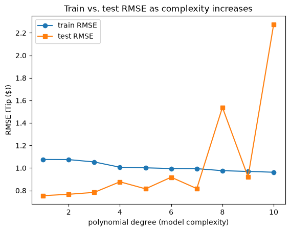

# Project Documentation

This site provides project documentation.
Use the documentation navigation to explore.

## How-To Guide

Many instructions are common to all our projects.

See
[⭐ **Workflow: Apply Example**](https://denisecase.github.io/pro-analytics-02/workflow-b-apply-example-project/)
to get the example projects running on your machine.

## Project Documentation Pages (docs/)

- **Home** - this documentation landing page
- [**Project Instructions**](./project-instructions.md)  - the standard project workflow
- [**Your Files**](./your-files.md) - how to copy the example and create your version
- [**Glossary**](./glossary.md) - project terms and concepts
- [**API**](./api.md) - autogenerated code documentation for the public project interface

## Phase 4. Technical Modification

- Adjusted the y-axis label formatting to match the other labels.
- Switched the Seaborn example from penguins to tips.
- Kept the notebook structure mostly the same and updated only the data and column references.
- Verified the change by running the notebook and confirming the regression outputs updated.

## Phase 5. Custom Project

- Used a simple supervised regression example based on the Seaborn tips dataset.
- Kept the same notebook workflow but changed the dataset, feature, and target.

### Basis and Data

- Started with the Seaborn penguins example.
- Changed to the Seaborn tips dataset for a simpler, different regression example.

### Modeling Approach

- Used a linear regression model for a numeric target.
- Chose this approach because it fits the notebook structure and shows the basic regression workflow clearly.

### Target

- Changed the target from body mass to tip.
- This kept the task numeric and made the model interpretation straightforward.

### Features

- Changed the feature from flipper length to total bill.
- Kept the overall structure the same and only updated the relevant labels and references.

### Evaluation and Results

- Evaluated the model with R-squared, RMSE, and a residual plot.
- The results were reasonable and showed the workflow working on the new dataset.

### Summary

- Implemented the same regression process with a new Seaborn dataset.
- Learned how to make a small project change while keeping the rest of the notebook intact.
